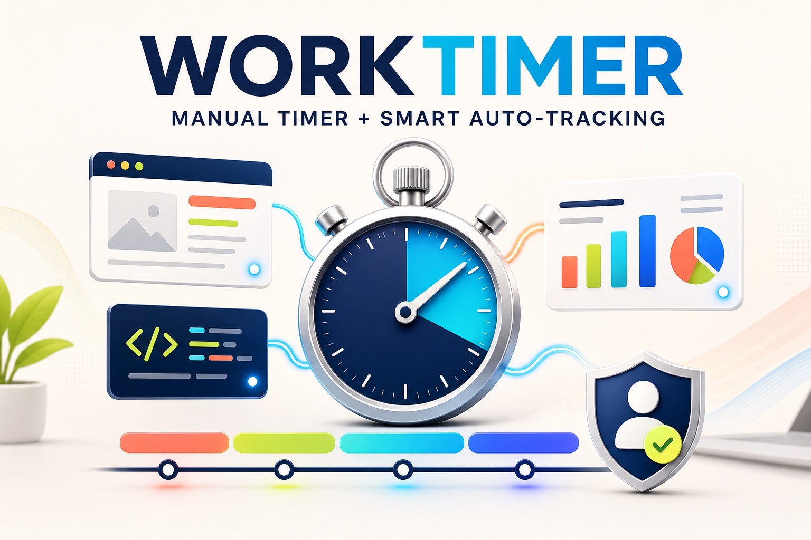

# Worktimer

[English](./README.md) · [Polski](./README.pl.md) · [Live app](https://worktimer-5gn.pages.dev)



Worktimer is a manual-first time tracker with an optional desktop automation
layer for macOS and Windows. You decide when work starts and stops; the helper
adds evidence about the foreground apps, browser domains, and window titles
used during that session.

It supports two storage modes:

- **Google / cloud** — one account, shared history, and one timer across devices.
- **Private local** — timer data stays in this browser on this device.

## What I built during OpenAI Build Week

Worktimer existed before Build Week, but it was mainly a manual START/STOP
timer. During Build Week, I used Codex and GPT-5.6 to turn it into the version
submitted here.

I built the optional desktop automation layer for macOS and Windows, connected
foreground app, window, and browser context to the running timer, and created
the editable summary shown after pressing STOP. I also added privacy masking,
automatic grouping of raw activity into readable work and distraction blocks,
safer activity uploads, and an interactive demo that judges can try without
installing the helper.

The commits from July 15–18, 2026 show how the original manual timer grew into
this automated, privacy-conscious workflow.

## How I used Codex and GPT-5.6

I used Codex with GPT-5.6 much like I would work with another developer sitting
next to me. I explained a real problem, asked Codex to trace the relevant part
of the existing code, read its proposed approach, and reviewed the changes. I
then ran the tests and checked the result in the browser or with a real desktop
helper session.

One concrete example was the summary created after pressing STOP. The helper
produced many small activity signals, but showing those signals directly would
have been noisy and difficult to understand. I asked Codex to follow the full
path from the desktop helper to the timer, help group the activity into readable
session blocks, and connect those blocks to an editable review screen.

Codex helped implement the changes and update the tests. I checked the result
using my own work sessions to see whether it correctly represented time spent
in Codex, the browser, and other applications.

GPT-5.6 was especially useful when reasoning about uncertain situations. An
open Codex window may represent focused development, but an open browser does
not automatically mean distraction. A short visit to another app might be
wasted time, or it might be necessary for the task.

That led to the main principle behind Worktimer: automation should provide
evidence, not pretend to know the absolute truth. The computer remembers the
context, but I decide what actually counts as work.

## Quick demo

You can try the live app in the browser without installing the desktop helper:

- [Open the live Worktimer demo](https://worktimer-5gn.pages.dev)
- [Watch the short product video on YouTube](https://youtu.be/1dr7PBxB-WM)

The sign-in screen includes a short sample session showing automatic context
detection and the editable summary flow. The sample does not collect or save
any data.

## Why this project exists

Most automatic trackers either collect too much or pretend that every open app
is productive work. Worktimer keeps the timer under human control and uses
automation only to answer useful questions at STOP:

- Which apps and websites were actually in the foreground?
- How much of the session was confirmed by the helper?
- Which blocks were work, distractions, or private activity?
- Did focus move away from work?
- Is the final record correct before it is saved?

## Main features

- manual START, pause, resume, and STOP
- editable activity review before saving
- optional automatic activity detection on macOS and Windows
- one cloud timer shared by multiple computers
- project suggestions based on app and domain rules
- optional auto-pause after helper silence
- private-domain masking before activity is stored
- manual session editing and CSV export
- Pomodoro, notifications, dashboard summaries, and PWA installation
- English and Polish interface

## How the automation works

The desktop helper is optional and is available in **Auto** mode with cloud
sync. It never starts or saves a work session without your decision.

| Stage      | What happens                                                                                                                                                                                         |
| ---------- | ---------------------------------------------------------------------------------------------------------------------------------------------------------------------------------------------------- |
| 1. START   | You start a real work session manually.                                                                                                                                                              |
| 2. Observe | Every five seconds locally, the helper reads the foreground application and window title. For supported browsers it also reads the active tab domain.                                                |
| 3. Protect | User-defined private domains are masked before the sample is stored.                                                                                                                                 |
| 4. Store   | The helper groups local samples and sends compact summary checkpoints about every 15 minutes; at STOP it sends one final summary. While idle it sends only a lightweight probe, never activity data. |
| 5. Review  | At STOP, the complete active-session sample window is merged into readable blocks.                                                                                                                   |
| 6. Correct | You can relabel every block as work, distraction, or private time.                                                                                                                                   |
| 7. Save    | Only the reviewed result is written to session history.                                                                                                                                              |

The sample stays local first in a small JSON buffer. The page receives the
live helper status over localhost and sends a short lease heartbeat only while
the timer is running. If the timer is stopped, paused, or the page disappears,
the lease expires and the helper stops capturing. No SQLite installation or
local copy of the repository is required. Cloud summaries are idempotent by
session and revision, so retrying a checkpoint cannot duplicate the same work.

### Automatic splitting at STOP

The default **Session split when saving** option prepares separate entries only
for private-time and distraction blocks. Work blocks stay together. You can
choose **Every helper context** when you want every detected context prepared
as its own entry, or **Never split automatically** to keep one final entry.
Nothing is written until you review and confirm the STOP dialog. A session with
only one block does not show a pointless multi-entry option.

Built-in rules treat Signal as private time and YouTube, Instagram, Tinder,
Reddit, Wykop, X, Facebook, and Allegro as distractions. You can correct every
classification before saving. With **High — store app only** privacy, browser
domains are intentionally hidden, so website-based distraction rules cannot
identify YouTube or similar sites; app-only privacy is the trade-off.

### Data-driven activity packs

Activity rules belong to the account, not to one hard-coded project name in the
frontend. A rule can match an application, a domain, or both, and can assign a
project, work category, and activity type. More specific rules win over generic
ones. When a rule does not specify a category, Worktimer infers it from the
categories previously used for that project.

The browser name alone is never treated as a category. For example, Chrome plus
Gmail may be communication, Chrome plus a project domain may be project work,
and Chrome plus a configured private domain may be private time. The same
grouped blocks are available from **Show activity** in session history. Raw
local polls are never sent as separate cloud requests or turned into separate
sessions.

Timer-generated session times are formatted using the browser's local timezone,
while manual entries keep the time the user entered.

The status beside the timer shows whether Auto is connected, which app/domain
is currently visible, and when the last helper signal arrived.

### What the helper detects

- foreground desktop application
- active window title
- active browser-tab domain where the browser exposes it
- Codex by its macOS application identifier, even when its process is named
  `ChatGPT`
- common development tools and terminals, including Terminal, iTerm2, Warp,
  Ghostty, Alacritty, kitty, WezTerm, Hyper, Windows Terminal, PowerShell,
  Command Prompt, WSL, Git Bash, VS Code, Cursor, Zed, Windsurf, and Xcode
- Chrome-installed Worktimer and PoprostuKoduj apps instead of the generic
  `app_mode_loader` label

The helper observes the foreground window. OBS, DaVinci Resolve, ScreenFlow,
or another recorder running only in the background does not replace the app in
which the work is happening.

### Understanding helper coverage

`Missing helper coverage` is time for which Worktimer has no fresh, trustworthy
helper signal. Typical causes are:

- the helper was started after the timer
- the helper process was stopped
- the computer slept or lost network access
- an obsolete key or launcher was used

Short gaps at the beginning and end are covered when a fresh signal arrives
within the connection threshold. During an active session the app loads that
session's full stored activity window, not only the latest status cards.

### Privacy model

- helper automation is opt-in
- the regular manual timer works without the helper
- tracking can be paused for 15 minutes, 60 minutes, or indefinitely
- private domains are configured by the user
- private domains and their window titles are masked before storage
- privacy level can store full context, mask sensitive title text, or store only
  the app name
- the STOP review can always override the suggested classification

## Using Mac and Windows together

Cloud mode has one active timer per account. The app may stay open on multiple
computers, while repeated START or STOP requests are handled safely.

Each computer should have its own helper key and starter:

1. Open **Auto** mode and expand **Automatic activity detection**.
2. Generate a helper key.
3. Download the starter for that computer.
4. Repeat on the other computer with a new key.

Creating a starter for another device does not revoke helpers that are already
running elsewhere.

## Running the desktop helper

### macOS starter

Download the Mac starter and keep its files in one folder. Then run:

```bash
zsh worktimer-helper-macos.command
```

Do not launch a browser-downloaded helper as `./worktimer-helper.mjs`; browser
downloads do not receive executable permission. The `.command` launcher already
contains the generated URL and key.

### Windows starter

Download the Windows starter, keep its files together, and run:

```text
worktimer-helper-windows.cmd
```

### Repository launcher

When running directly from a cloned repository:

```bash
node worktimer-helper.mjs --url "<ingest-url>" --key "<helper-key>"
```

Keep the terminal window open while the timer is running.

## Storage modes

### Google / cloud

Use this mode when you want:

- Google sign-in and Convex synchronization
- the same history on multiple devices
- the shared cloud timer
- desktop-helper automation and project rules

### Private local

Use this mode when you want:

- no sign-in
- no tracker queries or mutations sent to Convex
- data stored only in IndexedDB on the current device

If durable browser storage is unavailable, the app fails visibly instead of
pretending that data is being saved.

## Local development

Requirements:

- Node.js 22+
- a Convex project or your own Convex deployment

Install dependencies:

```bash
npm install
```

Set the frontend backend URL in `.env.local` or `.env`:

```bash
VITE_CONVEX_URL="https://your-project.convex.cloud"
```

Run Convex and Vite:

```bash
npx convex dev
npm run dev
```

The frontend starts at `http://localhost:3000`.

## Verification

```bash
npm run typecheck
npm run lint
npm run format:check
npm test
npm run build
npm run smoke
npm run ci
```

`npm run ci` runs strict type checking, linting, formatting verification, the
test suite, a production build, and a local static smoke test.

## Deployment

Deploy Convex first, then build the frontend against that production URL. A git
push alone does not publish the static frontend:

```bash
npx convex deploy
npm run deploy:production
```

The Pages deploy command explicitly uses `--branch main`; without that flag,
Wrangler can publish only a preview deployment while the production alias
continues serving an older bundle.

After deployment, verify the public Pages URL loads with HTTP 200 and run a
logged-in browser smoke for start/stop, the STOP review, and the split settings.
For the helper endpoint, an unauthenticated POST should return `401`, not
`404`; use a real helper key only for an authenticated smoke check.

For another environment:

```bash
VITE_CONVEX_URL="https://your-project.convex.cloud" npm run build
```

Deploy the generated `dist/` directory to a static host such as Cloudflare
Pages. Configure your own Convex deployment and OAuth credentials before
publishing a fork.

## Documentation

- [Polish README](./README.pl.md)
- [English compatibility path](./README.en.md)
- [Codex handoff and rebuild notes](./docs/codex-handoff-2026-07-07/START_HERE.md)
- [Human worklog from July 15–16, 2026](./docs/worklog-2026-07-15-2026-07-16.md)

## License and responsibility

This repository contains a productivity tool, not an employee-monitoring
system. Review privacy, retention, authentication, and deployment settings
before using it with other people or accounts.
